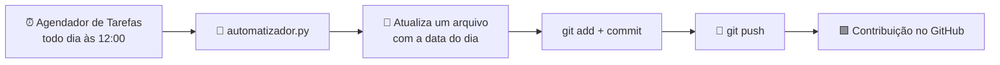

<div align="center">


<a href="https://github.com/SEU-USUARIO/AutomatizadorCommit">
  
</a>

<br/>


[Sobre](#-sobre) • [Como funciona](#-como-funciona) • [Instalação](#-instalação) • [Agendamento](#-agendando-no-windows) • [Dúvidas](#-problemas-comuns)

</div>

---

## 💡 Sobre

Eu estudo e construo projetos todo dia, mas nem sempre dá pra subir código novo. Então criei o **AutomatizadorCommit**: um script que faz **um commit automático por dia** no GitHub, mantendo meu **gráfico de contribuições** em dia sem eu precisar lembrar.

Ele roda **local**, na sua própria máquina, e é de **uso pessoal**. Sem servidor, sem custo. O **Agendador de Tarefas do Windows** dispara tudo sozinho no horário que você escolher.

## ⚙️ Como funciona



## 📦 Instalação

### Pré-requisitos

| Ferramenta | Pra quê | Download |
|---|---|---|
| **Git** | Fazer o commit e o push | [git-scm.com](https://git-scm.com/) |
| **Python 3** | Rodar o script | [python.org](https://www.python.org/downloads/) |
| **Conta no GitHub** | Receber os commits | [github.com](https://github.com/) |

> 💻 VS Code ou IntelliJ são opcionais, só pra editar o script se quiser.

### Passo a passo

**1️⃣ Baixe o projeto**

```bash
git clone https://github.com/SEU-USUARIO/AutomatizadorCommit.git
cd AutomatizadorCommit
```

Sem Git? Clique em **Code → Download ZIP**, extraia numa pasta fixa (ex.: `C:\Projetos\AutomatizadorCommit`).

**2️⃣ Crie um repositório só pra isso**

No GitHub, crie um repositório novo (o meu se chama `atividade-diaria`) e clone na sua máquina:

```bash
git clone https://github.com/SEU-USUARIO/atividade-diaria.git
```

**3️⃣ Ajuste o caminho no script**

Abra o `automatizador.py` e aponte para o seu repositório:

```python
REPO_PATH = r"C:\Users\SEU-USUARIO\Documents\atividade-diaria"
```

**4️⃣ Teste na mão**

```bash
python automatizador.py
```

Apareceu um commit novo no seu repositório? Deu certo ✅

## 🕛 Agendando no Windows

Pra rodar sozinho todo dia:

1. Abra o **Agendador de Tarefas** e clique em **Criar Tarefa Básica**
2. Nome: `AutomatizadorCommit` · Gatilho: **Diariamente** (eu uso 12:00)
3. Ação: **Iniciar um programa**
4. **Programa/script:** `python`
5. **Adicione argumentos:** caminho completo do `automatizador.py`
6. **Iniciar em:** pasta do projeto
7. Salve, clique com o botão direito na tarefa → **Executar** pra testar

> ✅ Resultado **`0x0`** = tudo certo.

## 🛠️ Problemas comuns

<details>
<summary><b>O PC estava desligado no horário</b></summary>
<br/>
Nas propriedades da tarefa, marque a opção de executar assim que possível caso um início agendado tenha sido perdido.
</details>

<details>
<summary><b>O git push pede senha</b></summary>
<br/>
Configure um token de acesso pessoal do GitHub ou use o Git Credential Manager.
</details>

<details>
<summary><b>A tarefa roda mas nada aparece no GitHub</b></summary>
<br/>
Confira se o campo <b>Iniciar em</b> está preenchido com a pasta do projeto e se o <code>REPO_PATH</code> está correto.
</details>

## 🧰 Tecnologias

Python · Git · GitHub · Agendador de Tarefas do Windows · VS Code · IntelliJ

## 📄 Licença

Distribuído sob a licença MIT.

---

<div align="center">

Feito com ☕ por **Crystian**

⭐ Se curtiu, deixa uma estrela no repositório!


</div>
Feito por Crystian 💻 Se curtiu, deixa uma ⭐ no repositório!
